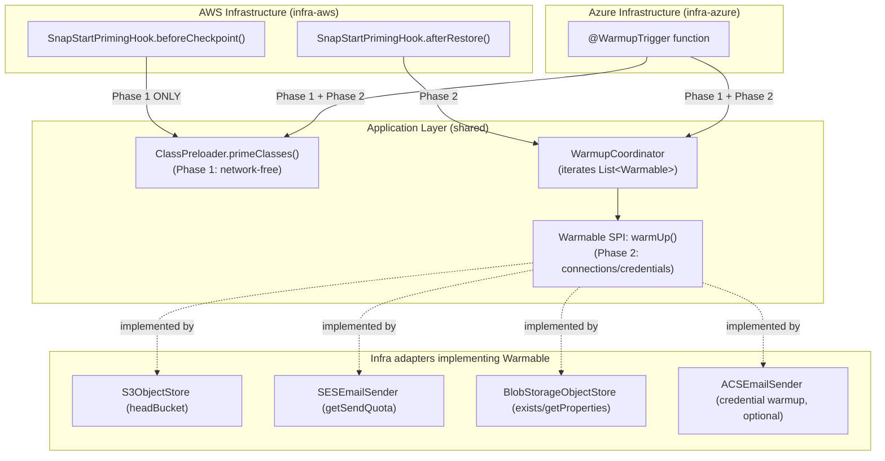

# Design Document: Cold-Start Optimization (ARM64, SnapStart, Priming) and Azure Flex Consumption

## Overview

This design covers cold-start optimization for the Kotlin Clean Architecture demo project. The work is scoped to two concerns:

1. **Move the Azure Function to the Flex Consumption plan (Requirement 1)** — Upgrade the Azure service plan from `Y1` (Consumption) to `FC1` (Flex Consumption) and switch to the flex-compatible function-app resource type. This is a hard **prerequisite** for the Azure side of the priming work, because the Azure `@WarmupTrigger` is only available on the Premium and Flex Consumption plans. The existing Linux OS type and Java 21 application stack are retained — no JVM, Kotlin, or dependency version changes are part of this feature.

2. **ARM64 architecture, SnapStart, and two-phase priming (Requirement 2)** — Enable ARM64 for AWS Lambda, turn on SnapStart (`PublishedVersions`), and add a shared **two-phase priming model** in the application layer:
   - **Phase 1 (`ClassPreloader.primeClasses()`)** — network-free class pre-loading and serialization-cache warmup.
   - **Phase 2 (`Warmable` SPI + `WarmupCoordinator`)** — connection/credential warmup performed by infrastructure adapters.

   AWS runs Phase 1 in the SnapStart `beforeCheckpoint` hook and Phase 2 in `afterRestore`. Azure runs both phases from a `@WarmupTrigger` function (which is why Requirement 1 is its prerequisite).

3. **Migrate the blob-triggered document processing to the Event Grid source (Requirement 3)** — The move to Flex Consumption (Requirement 1) is itself the trigger for this work: the **classic polling Blob Storage trigger is not supported on Flex Consumption**, which supports only the **Event Grid-based** (event-based) Blob Storage trigger. After the Flex move the `ProcessDocument` document-processing path is broken until the trigger declares the Event Grid source AND the Event Grid routing infrastructure (a storage system topic + an event subscription pointing at the function app's blob-extension webhook) is provisioned. This concern changes `ProcessDocument`'s `@BlobTrigger` to `source = BlobTriggerSource.EVENT_GRID` (keeping the existing path and connection), declares the `azure-functions-java-library` version that exposes `BlobTriggerSource` on the `:infra-azure` module, and adds the Event Grid system topic + event subscription to the Azure CDK stack. Managed-identity authentication on the trigger connection is preserved (no shared access key).

The design preserves the clean architecture layering (domain → application → infrastructure) and the dual-cloud deployment model. There are no new health check endpoints, no pipeline health-check steps, and no deployment checkpoints. Verification of the change uses the **existing `docs-flow` endpoint** (API key on AWS, function key on Azure), backed by unit tests for the priming components and CDK synth tests for the infrastructure changes.

## Architecture

### Priming Architecture

The priming model has **two phases** with different safety characteristics:

- **Phase 1 — Class_Preload (`primeClasses()`)**: network-free, pure class loading and in-memory serialization warmup. Safe to run anywhere, including inside a SnapStart snapshot.
- **Phase 2 — Warmable warmup (`warmUp()`)**: opens network connections and fetches managed-identity tokens. Must NOT run inside a snapshot (`beforeCheckpoint`), because connections and tokens captured at checkpoint time are invalid after the snapshot is restored on a different host.



### Clean Architecture Layer Impact

| Layer | Changes |
|-------|---------|
| **Domain** | No changes. Domain ports `ObjectStorageInterface` and `DocumentNotificationInterface` keep their existing operations only — they do NOT declare `warmUp()` (Requirement 2.9) |
| **Application** | Add `ClassPreloader` (Phase 1, network-free `primeClasses()`); add `Warmable` SPI + `WarmupCoordinator` (Phase 2 connection/credential warmup) |
| **Infra-AWS** | SnapStart + ARM64; `SnapStartPrimingHook` (`beforeCheckpoint` → Phase 1 only, `afterRestore` → Phase 2); `S3ObjectStore`/`SESEmailSender` additionally implement `Warmable` |
| **Infra-Azure** | `@WarmupTrigger` function runs Phase 1 + Phase 2; `BlobStorageObjectStore` (and optionally `ACSEmailSender`) additionally implement `Warmable`; `ProcessDocument`'s `@BlobTrigger` switches to `source = BlobTriggerSource.EVENT_GRID` (path/connection unchanged) (Requirement 3.1, 3.2, 3.7); `:infra-azure` declares the `azure-functions-java-library` version exposing `BlobTriggerSource` (Requirement 3.3) |
| **CDK-AWS** | ARM64 architecture, SnapStart (`PublishedVersions`), published version + API Gateway alias wiring |
| **CDK-Azure** | Flex Consumption plan (`Y1` → `FC1`), flex-compatible function-app resource type, Linux + existing Java 21 stack retained; **adds Event Grid routing**: storage system topic + event subscription delivering `BlobCreated` events for the `docs-flow` container to the function app's blob-extension webhook (Requirement 3.4, 3.5) |
| **CI/CD** | Deploy as today, then verify via the existing `docs-flow` endpoint (no new pipeline steps required) |

## Components and Interfaces

### 1. Two-Phase Priming Components (Application Layer)

Priming is split into two components in the shared application layer so both AWS and Azure invoke the same logic. The split exists because the two phases have different safety characteristics under SnapStart (see Priming Architecture above).

#### 1a. Phase 1 — `ClassPreloader` (network-free)

Pre-loads application classes and warms the Jackson/Spring Cloud Function serialization caches by round-tripping a sample `HttpRequest`/`HttpResponse`. It performs **no network or filesystem I/O** and is wrapped in `runCatching` so it never throws. Safe to run in AWS `beforeCheckpoint`, AWS `afterRestore`, and Azure warmup.

```kotlin
// software/application/src/main/kotlin/com/example/clean/architecture/service/ClassPreloader.kt
package com.example.clean.architecture.service

import com.example.clean.architecture.model.HttpRequest
import com.example.clean.architecture.model.HttpResponse
import com.fasterxml.jackson.databind.ObjectMapper
import io.github.oshai.kotlinlogging.KotlinLogging
import org.springframework.http.HttpMethod
import org.springframework.http.HttpStatusCode
import org.springframework.stereotype.Component

private val logger = KotlinLogging.logger {}

/**
 * Phase 1 priming: pre-loads classes and warms serialization caches.
 * Performs NO network or filesystem I/O — safe inside a SnapStart snapshot.
 */
@Component
class ClassPreloader(
    private val objectMapper: ObjectMapper,
) {
    fun primeClasses() {
        logger.info { "Phase 1 priming: pre-loading classes and warming serialization caches" }
        runCatching {
            // Round-trip a sample request/response through the Jackson converters used by
            // Spring Cloud Function. This forces class loading + serializer cache population
            // without any I/O.
            val sampleRequest = HttpRequest(
                method = HttpMethod.POST,
                headers = mapOf("Content-Type" to "application/json"),
                path = "/docs-flow",
                queryParameters = emptyMap(),
                body = null,
            )
            val requestJson = objectMapper.writeValueAsString(sampleRequest)
            objectMapper.readValue(requestJson, HttpRequest::class.java)

            val sampleResponse = HttpResponse(
                httpStatusCode = HttpStatusCode.valueOf(200),
                body = """{"status":"ok"}""",
            )
            objectMapper.writeValueAsString(sampleResponse)

            logger.info { "Phase 1 priming completed successfully" }
        }.onFailure { e ->
            logger.warn(e) { "Phase 1 priming encountered non-fatal error" }
        }
    }
}
```

**Design Decision**: Phase 1 is intentionally network-free. Because it only touches the JVM (class loading) and in-memory serializers, its result is safe to capture in a SnapStart snapshot and safe to repeat in `afterRestore` and Azure warmup (Requirements 2.4, 2.5, 2.6).

#### 1b. Phase 2 — `Warmable` SPI + `WarmupCoordinator` (connection/credential warmup)

`Warmable` is a separate application-layer SPI (a functional interface with a `warmUp()` operation). Infrastructure adapters optionally implement it to open their network connection and/or fetch their managed-identity token. The domain ports (`ObjectStorageInterface`, `DocumentNotificationInterface`) are deliberately **not** touched (Requirement 2.9).

```kotlin
// software/application/src/main/kotlin/com/example/clean/architecture/warmup/Warmable.kt
package com.example.clean.architecture.warmup

/**
 * Phase 2 priming SPI. Infrastructure adapters MAY implement this to open their
 * network connection and/or fetch their managed-identity token before serving traffic.
 *
 * This is intentionally separate from the domain ports (ObjectStorageInterface,
 * DocumentNotificationInterface), which MUST NOT declare warmUp().
 */
fun interface Warmable {
    fun warmUp()
}
```

A coordinator receives every `Warmable` bean Spring discovered and warms each one, isolating failures so a single failing adapter does not abort the rest.

```kotlin
// software/application/src/main/kotlin/com/example/clean/architecture/warmup/WarmupCoordinator.kt
package com.example.clean.architecture.warmup

import io.github.oshai.kotlinlogging.KotlinLogging
import org.springframework.stereotype.Component

private val logger = KotlinLogging.logger {}

/**
 * Phase 2 priming: iterates all Warmable adapters and warms each one.
 * Each warmUp() is wrapped in runCatching so one failure does not abort the rest.
 */
@Component
class WarmupCoordinator(
    private val warmables: List<Warmable>,
) {
    fun warmUpConnections() {
        logger.info { "Phase 2 priming: warming up ${warmables.size} connection(s)/credential(s)" }
        warmables.forEach { warmable ->
            runCatching { warmable.warmUp() }
                .onFailure { e -> logger.warn(e) { "Warmable failed to warm up (non-fatal): ${warmable.javaClass.simpleName}" } }
        }
    }
}
```

**Design Decision**: Injecting `List<Warmable>` (Spring collects all beans implementing the interface; `ObjectProvider<Warmable>` is an equivalent lazy alternative) keeps the coordinator agnostic of which adapters exist. If no adapter implements `Warmable`, the list is empty and Phase 2 is a no-op. Each call is isolated with `runCatching` so a failing warmup (e.g., a transient network error) degrades cold-start performance but never blocks startup (Requirements 2.8, 2.10).

#### 1c. Infra adapters implementing `Warmable`

Adapters add `Warmable` to their existing interface list and perform a single low-cost call (Requirement 2.10):

```kotlin
// infra-aws: S3ObjectStore additionally implements Warmable
class S3ObjectStore(
    @Value("\${aws.s3.bucket-name}") private val bucketName: String,
    private val s3Client: S3Client,
) : ObjectStorageInterface, Warmable {
    override fun warmUp() = runBlocking {
        s3Client.headBucket { bucket = bucketName }   // opens connection, no payload
        Unit
    }
    // ... existing save()/generateSecureAccessUri() unchanged
}

// infra-aws: SESEmailSender additionally implements Warmable
class SESEmailSender(/* ... */) : DocumentNotificationInterface, Warmable {
    override fun warmUp() = runBlocking {
        sesClient.getSendQuota()   // credential + connection warmup, NOT a real send
        Unit
    }
}

// infra-azure: BlobStorageObjectStore additionally implements Warmable
class BlobStorageObjectStore(/* ... */) : ObjectStorageInterface, Warmable {
    override fun warmUp() {
        // exists()/getProperties() forces the DefaultAzureCredential managed-identity token fetch
        containerClient.exists()
    }
}

// infra-azure (optional): ACSEmailSender additionally implements Warmable
//   override fun warmUp() { /* credential warmup only — NOT a real send */ }
```

**Clean-architecture note**: `Warmable` lives in the application layer alongside the domain ports but is a distinct SPI. The domain ports `ObjectStorageInterface` and `DocumentNotificationInterface` keep their existing operations only — they do not declare `warmUp()` (Requirement 2.9).

### 2. AWS SnapStart + ARM64 + Version Alias (CDK-AWS)

Changes to all Lambda function definitions in the AWS CDK stack (Requirements 2.1, 2.2, 2.3):
- `architectures` set to `["arm64"]`
- `snap_start` with `apply_on = "PublishedVersions"`
- A published Lambda version on each deployment, with the API Gateway integration wired to invoke the published version alias (required for SnapStart to take effect)

### 3. AWS SnapStart Priming Hook (Infra-AWS)

The hook implements `org.crac.Resource` and splits the two phases across the CRaC lifecycle:

- `beforeCheckpoint()` runs at publish time, before the snapshot is frozen, so it MUST run **Phase 1 only**. Connections and tokens are unsafe to snapshot (Requirements 2.7, 2.11).
- `afterRestore()` runs on the serving host after thaw, so it runs **Phase 2** to (re)establish connections and fetch a fresh managed-identity token (Requirement 2.12).

```kotlin
import com.example.clean.architecture.service.ClassPreloader
import com.example.clean.architecture.warmup.WarmupCoordinator
import io.github.oshai.kotlinlogging.KotlinLogging
import org.crac.Context
import org.crac.Core
import org.crac.Resource
import org.springframework.stereotype.Component

private val logger = KotlinLogging.logger {}

@Component
class SnapStartPrimingHook(
    private val classPreloader: ClassPreloader,
    private val warmupCoordinator: WarmupCoordinator,
) : Resource {
    init {
        Core.getGlobalContext().register(this)
    }

    override fun beforeCheckpoint(context: Context<out Resource>) {
        // Phase 1 ONLY — network-free. MUST NOT warm connections/credentials here:
        // anything opened now is invalid once the snapshot is restored on another host.
        logger.info { "beforeCheckpoint: running Phase 1 class preload only" }
        classPreloader.primeClasses()
    }

    override fun afterRestore(context: Context<out Resource>) {
        // Phase 2 — re-establish connections and fetch credentials on the serving host.
        logger.info { "afterRestore: running Phase 2 connection/credential warmup" }
        warmupCoordinator.warmUpConnections()
    }
}
```

### 4. Azure Warmup Trigger (Infra-Azure)

The `@WarmupTrigger` runs on every fresh instance on the real serving host before it takes traffic, so it safely runs **both** phases (Requirement 2.13). This trigger is only available on the Premium and Flex Consumption plans, which is why the Flex Consumption move (Requirement 1) is its prerequisite.

```kotlin
@FunctionName("Warmup")
fun warmup(
    @WarmupTrigger(name = "warmupTrigger") warmupContext: String,
    context: ExecutionContext,
) {
    logger.info { "Warmup trigger invoked: running Phase 1 (class preload) and Phase 2 (connection/credential warmup)" }
    classPreloader.primeClasses()         // Phase 1: network-free
    warmupCoordinator.warmUpConnections() // Phase 2: open connections / fetch managed-identity token
}
```

`classPreloader` and `warmupCoordinator` are injected as `private val` dependencies from the application layer.

### 5. Azure Flex Consumption Plan (CDK-Azure)

The Azure CDK stack changes the hosting plan from Consumption to Flex Consumption (Requirement 1):

- Service plan SKU changes from `Y1` to `FC1` (Requirement 1.1).
- The function app uses the flex-compatible resource type `azurerm_linux_function_app_flex_consumption` instead of `azurerm_linux_function_app` (Requirement 1.2).
- All existing application settings (`APPINSIGHTS_INSTRUMENTATIONKEY`, `MAIN_CLASS`, `TriggerBlobStorage__accountName`, `TriggerBlobStorage__credential`, `WEBSITE_RUN_FROM_PACKAGE`, `ACS_ENDPOINT`), the SystemAssigned managed identity, and all role assignments (Storage Blob Data Contributor, Storage Account Contributor, Storage Queue Data Contributor, and the custom ACS role) are explicitly preserved in the stack so the plan move does not drop them (Requirement 1.4).
- The Linux OS type and the **existing Java 21** application stack are retained — no JVM version change (Requirement 1.5).

**Design Decision**: Switching the service-plan SKU and the function-app resource type is a destroy-and-recreate operation in Terraform. The CDK stack declares every app setting, identity, and role assignment explicitly so the recreated function app comes back with identical configuration and no drift.

### 6. Event Grid-Based Blob Trigger Migration (Infra-Azure + CDK-Azure)

This section designs Requirement 3. Moving to Flex Consumption (Requirement 1) removes support for the legacy **polling** Blob Storage trigger; Flex Consumption supports **only** the **Event Grid-sourced** Blob Storage trigger. The current `ProcessDocument` function uses the polling trigger, so after the Flex move the document-processing path stops firing until two things change together:

1. the function declares the **Event Grid trigger source**, and
2. the infrastructure provisions an **Event Grid system topic + event subscription** that routes `Microsoft.Storage.BlobCreated` events from the `docsflow` storage account to the function app's built-in **blob-extension webhook**.

```mermaid
flowchart LR
    Upload["Blob uploaded to\ndocsflow / docs-flow/{name}"] --> SA["Storage Account: docsflow"]
    SA -->|emits Microsoft.Storage.BlobCreated| Topic["azurerm_eventgrid_system_topic\n(topic_type = Microsoft.Storage.StorageAccounts)"]
    Topic --> Sub["azurerm_eventgrid_system_topic_event_subscription\nfilter: BlobCreated\nsubject begins: /blobServices/default/containers/docs-flow/"]
    Sub -->|webhook delivery| WH["Function app blob-extension endpoint\n/runtime/webhooks/blobs?functionName=Host.Functions.ProcessDocument"]
    WH --> PD["ProcessDocument\n@BlobTrigger(source = EVENT_GRID)"]
    PD --> Flow["reviewAndNotifyDocument(name)"]
```



#### 6a. `ProcessDocument` trigger source change (application/infra code)

Only the trigger **source** changes. The `name`, `path`, and `connection` are retained so the bound `content`/`name` parameters and the managed-identity connection setting continue to work unchanged (Requirements 3.1, 3.2, 3.7).

> **Implementation note (Java library):** The `azure-functions-java-library` does **not** ship a `BlobTriggerSource` enum — that type is a C#/.NET isolated-worker concept. In the Java library the `@BlobTrigger` `source` attribute is a plain `String`, so the Event Grid source is selected with the **String literal `source = "EventGrid"`** and **no `BlobTriggerSource` import**. (The earlier draft referenced `BlobTriggerSource.EVENT_GRID`, which does not compile against the Java library.)

```kotlin
// software/infrastructure/azure/.../DocsFlowFunctions.kt
import com.microsoft.azure.functions.annotation.BlobTrigger

@FunctionName("ProcessDocument")
fun processDocument(
    @BlobTrigger(
        name = "content",
        source = "EventGrid",                       // NEW — event-based source, String (Requirement 3.1)
        path = "docs-flow/{name}",                  // unchanged (Requirement 3.2)
        connection = "TriggerBlobStorage"           // unchanged (Requirements 3.2, 3.7)
    ) content: ByteArray,
    @BindingName("name") name: String,
    context: ExecutionContext,
) {
    logger.info { "Document name: $name, size: ${content.size}" }
    val result = reviewAndNotifyDocument(name)
    logger.info { "Processed document from blob storage: ${result.getOrNull()}" }
}
```

**Design Decision — managed identity is preserved (Requirement 3.7)**: The `connection = "TriggerBlobStorage"` setting and its companion app settings `TriggerBlobStorage__accountName = "docsflow"` and `TriggerBlobStorage__credential = "managedidentity"` are unchanged. With the Event Grid source, the blob-extension still reads the blob payload from the storage account using the function app's SystemAssigned managed identity (no shared access key is introduced). The Storage Blob Data Contributor role assignment from Requirement 1 already grants the required data-plane access.

#### 6b. Build dependency: `azure-functions-java-library` version exposing `BlobTriggerSource` (Requirement 3.3)

`BlobTriggerSource` (and the `source` attribute on `@BlobTrigger`) is only available in a sufficiently recent `azure-functions-java-library`. Today `:infra-azure` pulls that library **transitively** through `spring-cloud-function-adapter-azure:4.2.2`, so the available version is implicit and not guaranteed to expose `BlobTriggerSource.EVENT_GRID`.

**Design Decision**: `software/infrastructure/azure/build.gradle.kts` MUST declare `com.microsoft.azure.functions:azure-functions-java-library` **explicitly**, pinned to a version that exposes `BlobTriggerSource` with the `EVENT_GRID` source (the `3.1.0+` line provides the `source` attribute / `BlobTriggerSource` type). Declaring it explicitly (rather than relying on the transitive version from the Spring Cloud Function adapter) makes the event-based trigger a deliberate, verifiable build contract and prevents a transitive downgrade from silently breaking compilation of the `source = BlobTriggerSource.EVENT_GRID` reference.

```kotlin
// software/infrastructure/azure/build.gradle.kts (dependencies block)
// Was transitive via spring-cloud-function-adapter-azure; now explicit so the @BlobTrigger
// String `source` attribute ("EventGrid") is guaranteed at compile time.
implementation("com.microsoft.azure.functions:azure-functions-java-library:3.1.0")
```

#### 6c. Event Grid routing in the Azure CDK stack (Requirements 3.4, 3.5)

Two resources are added to `AzureStack.kt` using the existing `com.hashicorp:cdktf-provider-azurerm:13.20.1` (azurerm provider `~> 3.0` / 4.21.1-compatible) CDKTF bindings:

**System topic** (`azurerm_eventgrid_system_topic`) — represents the `docsflow` storage account as an event source (Requirement 3.4):

```kotlin
import com.hashicorp.cdktf.providers.azurerm.eventgrid_system_topic.EventgridSystemTopic
import com.hashicorp.cdktf.providers.azurerm.eventgrid_system_topic.EventgridSystemTopicConfig

val blobSystemTopic = EventgridSystemTopic(
    this, "DocsFlowBlobSystemTopic",
    EventgridSystemTopicConfig.builder()
        .name("docsflow-blob-created-topic")
        .resourceGroupName(resourceGroup.name)
        .location(resourceGroup.location)
        .topicType("Microsoft.Storage.StorageAccounts")          // storage-account source
        .sourceArmResourceId(storageAccountDocsFlow.id)          // the docsflow storage account
        .dependsOn(listOf(storageAccountDocsFlow))
        .build()
)
```

**Event subscription** (`azurerm_eventgrid_system_topic_event_subscription`) — filters the topic to `BlobCreated` events scoped to the `docs-flow` container and delivers them to the function app's blob-extension webhook (Requirement 3.5):

```kotlin
import com.hashicorp.cdktf.providers.azurerm.eventgrid_system_topic_event_subscription.EventgridSystemTopicEventSubscription
import com.hashicorp.cdktf.providers.azurerm.eventgrid_system_topic_event_subscription.EventgridSystemTopicEventSubscriptionConfig
import com.hashicorp.cdktf.providers.azurerm.eventgrid_system_topic_event_subscription.EventgridSystemTopicEventSubscriptionSubjectFilter
import com.hashicorp.cdktf.providers.azurerm.eventgrid_system_topic_event_subscription.EventgridSystemTopicEventSubscriptionWebhookEndpoint

EventgridSystemTopicEventSubscription(
    this, "DocsFlowBlobEventSubscription",
    EventgridSystemTopicEventSubscriptionConfig.builder()
        .name("docsflow-process-document-sub")
        .systemTopic(blobSystemTopic.name)
        .resourceGroupName(resourceGroup.name)
        .includedEventTypes(listOf("Microsoft.Storage.BlobCreated"))            // Requirement 3.5
        .subjectFilter(
            EventgridSystemTopicEventSubscriptionSubjectFilter.builder()
                // scope to the docs-flow container only
                .subjectBeginsWith("/blobServices/default/containers/docs-flow/")
                .build()
        )
        .webhookEndpoint(
            EventgridSystemTopicEventSubscriptionWebhookEndpoint.builder()
                // blob-extension webhook on the function app (see 6d for the URL form + system key)
                .url(blobExtensionWebhookUrl)
                .build()
        )
        .dependsOn(listOf(blobSystemTopic, functionApp))
        .build()
)
```

#### 6d. Blob-extension webhook endpoint URL and system key

Event Grid delivers blob events to the function app's built-in blob-extension endpoint. The URL has the form:

```
https://<functionapp-hostname>/runtime/webhooks/blobs?functionName=Host.Functions.ProcessDocument&code=<blob_extension_key>
```

- `<functionapp-hostname>` — the function app's default hostname (`<app-name>.azurewebsites.net`), available from the function-app resource (`functionApp.defaultHostname`).
- `functionName=Host.Functions.ProcessDocument` — the `Host.Functions.` prefix plus the `@FunctionName` value (`ProcessDocument`).
- `code=<blob_extension_key>` — the **`blobs_extension`** function-app **system key** that authorizes the webhook. While the trigger connection authenticates to storage via managed identity, this system key protects the webhook endpoint itself from unauthorized callers.

**Design Decision — obtaining the blob-extension system key**: The `blobs_extension` system key is generated by the Functions host and is not a value the stack defines. In the CDK stack it is referenced (not hard-coded) via the azurerm data source `azurerm_function_app_host_keys`. In the project's provider (`cdktf-provider-azurerm:13.20.1`, azurerm 4.21.1) the blob-extension system key is exposed on that data source as the **`blobs_extension_key`** attribute (CDKTF getter `getBlobsExtensionKey()`). The webhook URL is then assembled from `functionApp.defaultHostname` and that referenced key:

```kotlin
import com.hashicorp.cdktf.providers.azurerm.data_azurerm_function_app_host_keys.DataAzurermFunctionAppHostKeys
import com.hashicorp.cdktf.providers.azurerm.data_azurerm_function_app_host_keys.DataAzurermFunctionAppHostKeysConfig

val functionAppHostKeys = DataAzurermFunctionAppHostKeys(
    this, "DocsFlowFunctionAppHostKeys",
    DataAzurermFunctionAppHostKeysConfig.builder()
        .name(functionApp.name)
        .resourceGroupName(resourceGroup.name)
        .build()
)

val blobExtensionWebhookUrl =
    "https://${functionApp.defaultHostname}/runtime/webhooks/blobs" +
        "?functionName=Host.Functions.ProcessDocument" +
        "&code=\${${functionAppHostKeys.fqn}.blobs_extension_key}"
```

The key flows only into the event-subscription resource argument at apply time (a Terraform reference/interpolation); it is never echoed to logs or committed in source. **Assumption/decision to document**: if the installed azurerm provider version (4.21.x) does not surface `blobs_extension_key` on `azurerm_function_app_host_keys` for the Flex Consumption resource, the subscription's webhook destination is created as a documented post-deploy/import step (or via a small `terraform_data`/null-resource that reads the key with the Azure CLI inside the same apply), keeping the key out of source control. The preferred path is the data-source reference above; the fallback is recorded here so the destination can always be wired without persisting the secret.

**Design Decision — destroy/recreate, ordering, and dependency considerations**:
- The system topic depends on the `docsflow` storage account (`source_arm_resource_id`); `dependsOn(storageAccountDocsFlow)` enforces creation order.
- The event subscription depends on both the system topic and the function app (the webhook destination must exist and pass Event Grid's validation handshake before the subscription is active); `dependsOn(blobSystemTopic, functionApp)` enforces this.
- Because Requirement 1 recreates the function app (SKU + resource-type change is a destroy/recreate), the function-app hostname and the `blobs_extension` system key are (re)generated on recreate. The host-keys data source is re-read on each apply so the webhook URL always reflects the current app, avoiding a stale endpoint. Event Grid does not allow updating an existing subscription's endpoint URL, so a hostname/key change implies the subscription is replaced — the explicit `dependsOn` ensures Terraform recreates the subscription after the function app.

## Data Models

### Infrastructure Configuration Changes Summary

| Configuration | Current | Target | Requirement |
|--------------|---------|--------|-------------|
| Azure service plan SKU | `Y1` (Consumption) | `FC1` (Flex Consumption) | 1.1 |
| Azure function-app resource type | `azurerm_linux_function_app` | `azurerm_linux_function_app_flex_consumption` | 1.2 |
| Azure OS type | Linux | Linux (unchanged) | 1.5 |
| Azure Java stack | Java 21 | Java 21 (unchanged) | 1.5 |
| Lambda architecture | x86_64 (default) | `arm64` | 2.1 |
| SnapStart | disabled | enabled (`PublishedVersions`) | 2.2 |
| Lambda version/alias | unversioned | published version + API Gateway alias | 2.3 |

### Event Grid Blob Trigger Migration Summary (Requirement 3)

| Element | Current | Target | Requirement |
|---------|---------|--------|-------------|
| `ProcessDocument` `@BlobTrigger` source | polling (default, no `source`) | `source = "EventGrid"` (String — Java library has no `BlobTriggerSource` enum) | 3.1 |
| `ProcessDocument` trigger `path` / `connection` | `docs-flow/{name}` / `TriggerBlobStorage` | unchanged | 3.2 |
| `:infra-azure` `azure-functions-java-library` | transitive (via `spring-cloud-function-adapter-azure:4.2.2`) | explicit pinned version exposing `BlobTriggerSource` | 3.3 |
| Event Grid system topic | none | `azurerm_eventgrid_system_topic` (`topic_type = Microsoft.Storage.StorageAccounts`, source = `docsflow` storage account) | 3.4 |
| Event Grid event subscription | none | `azurerm_eventgrid_system_topic_event_subscription` (filter `Microsoft.Storage.BlobCreated`, subject begins `/blobServices/default/containers/docs-flow/`, webhook → blob-extension endpoint) | 3.5 |
| Trigger storage authentication | managed identity (`TriggerBlobStorage__credential = managedidentity`) | unchanged (managed identity, no shared access key) | 3.7 |

### Sample Priming Model Values

Phase 1 round-trips the existing `HttpRequest`/`HttpResponse` application models (no new data model is introduced):

```kotlin
HttpRequest(
    method = HttpMethod.POST,
    headers = mapOf("Content-Type" to "application/json"),
    path = "/docs-flow",
    queryParameters = emptyMap(),
    body = null,
)
```

## Correctness Properties

*A property is a characteristic or behavior that should hold true across all valid executions of a system — essentially, a formal statement about what the system should do. Properties serve as the bridge between human-readable specifications and machine-verifiable correctness guarantees.*

> **Note:** Most of this feature is declarative infrastructure (Azure Flex Consumption SKU/resource type, AWS ARM64/SnapStart) verified with CDK synth tests, plus example-based wiring tests. The two properties below capture the priming **safety invariants** that hold across any application state and any set of registered `Warmable` adapters — the parts where behavior must be guaranteed regardless of configuration. **Requirement 3 (Event Grid trigger migration) adds no correctness property**: it is a declarative-infrastructure change (Event Grid system topic + event subscription in the CDK stack) plus a single trigger-source wiring change on `ProcessDocument`. There is no meaningful input space to quantify over, so it is covered by CDK synth tests and example-based wiring assertions (see Testing Strategy).

### Property 1: Priming safety and failure isolation

*For any* state of the application's dependency graph and *for any* set of registered `Warmable` adapters:
- `ClassPreloader.primeClasses()` (Phase 1) SHALL complete without throwing an exception that propagates to the caller, regardless of the dependency-graph state — it never prevents application startup, and it performs no network or filesystem I/O while round-tripping the sample `HttpRequest`/`HttpResponse`; and
- each `Warmable.warmUp()` invocation orchestrated by `WarmupCoordinator` (Phase 2) SHALL be isolated such that a failure in one adapter's warmup is caught and does not abort the warmup of the remaining adapters nor propagate to the caller.

**Validates: Requirements 2.4, 2.5, 2.8, 2.10**

### Property 2: Checkpoint phase isolation

*For any* set of registered `Warmable` adapters, when `SnapStartPrimingHook.beforeCheckpoint()` executes, it SHALL invoke `ClassPreloader.primeClasses()` (Phase 1) and SHALL NOT invoke any `Warmable.warmUp()` / `WarmupCoordinator.warmUpConnections()` (Phase 2) — connection and credential warmup never runs inside the SnapStart snapshot.

**Validates: Requirements 2.7, 2.11**

## Error Handling

### Priming Errors

| Scenario | Behavior |
|----------|----------|
| Class/serialization warmup fails during `primeClasses()` (Phase 1) | Caught by `runCatching`, logged as warning, application continues (non-fatal) |
| A single `Warmable.warmUp()` fails (Phase 2) | Caught per-adapter by `WarmupCoordinator`, logged as warning, remaining adapters still warmed; never propagates |
| `beforeCheckpoint` runs Phase 1 only | By design, no connection/credential warmup occurs inside the snapshot (Requirement 2.11) |
| `afterRestore` / Azure warmup Phase 2 fails entirely | Logged, application continues; first real request re-establishes connections lazily (slower cold start, not an outage) |

**Design Decision**: Both phases are non-fatal. Phase 1 (`primeClasses()`) is wrapped in `runCatching` and Phase 2 isolates each `Warmable` so one adapter's failure does not abort the others. The application still functions even if priming doesn't complete — it just has a slower cold start. Connection/credential warmup is deliberately excluded from `beforeCheckpoint` because connections and managed-identity tokens captured at checkpoint time are invalid once the snapshot is restored on a different host.

### Azure Flex Consumption Migration Errors

| Scenario | Behavior |
|----------|----------|
| FC1 SKU not available in region | Terraform apply fails with a clear error |
| Resource type change (`azurerm_linux_function_app` → flex consumption) | Terraform plan shows destroy+recreate (expected for the plan move) |
| App settings / identity / roles lost during migration | CDK stack explicitly declares all settings, the SystemAssigned identity, and all role assignments (no drift) |

### Event Grid Blob Trigger Migration Errors (Requirement 3)

| Scenario | Behavior |
|----------|----------|
| Event Grid validation handshake fails when creating the subscription (webhook unreachable or wrong key) | Terraform apply fails creating `azurerm_eventgrid_system_topic_event_subscription`; the explicit `dependsOn(functionApp)` ensures the function app (and its blob-extension endpoint) exists first so the validation handshake can succeed |
| `blob_storage_extension_key` not available on the host-keys data source for the Flex resource | Documented fallback in §6d: wire the webhook destination via a post-deploy/import step or an in-apply CLI read of the `blobs_extension` key — the key is never committed to source |
| Function app recreated by the Flex move (Requirement 1) → hostname/system key change | Host-keys data source is re-read each apply; Event Grid forbids updating an existing subscription endpoint URL, so Terraform replaces the subscription (ordered after the function app via `dependsOn`) |
| Blob uploaded but event filtered out (outside `docs-flow` container or non-`BlobCreated`) | By design — the subject filter `/blobServices/default/containers/docs-flow/` and `Microsoft.Storage.BlobCreated` type scope delivery to the intended container/events only (Requirement 3.5) |
| `BlobTriggerSource` symbol not resolvable at compile time | `:infra-azure` declares the `azure-functions-java-library` version explicitly (Requirement 3.3); a CI compile failure surfaces a transitive-version regression immediately rather than at deploy time |
| Trigger connection still authenticates via managed identity after the source change | Preserved — `TriggerBlobStorage__credential = managedidentity` and the Storage Blob Data Contributor role are unchanged, so the event-based trigger reads blobs with the managed identity (no shared key) (Requirement 3.7) |

## Testing Strategy

### Why Property-Based Testing Mostly Does NOT Apply

This feature is primarily composed of:
- **Infrastructure as Code** (CDK stacks in Kotlin generating Terraform JSON for Azure Flex Consumption and AWS ARM64/SnapStart)
- **Side-effect-only operations** (priming = class loading + connection/credential warmup)
- **Wiring** (which hook/trigger calls which priming phase)

These are declarative configuration or fixed side-effects with no meaningful input space to explore. The two priming **safety invariants** (Correctness Properties 1 and 2) are the exception: they must hold for any application state and any set of registered `Warmable` adapters, so they are expressed as properties and exercised with mocked collaborators / varying adapter sets. Everything else is covered by example-based unit tests and CDK synth tests.

### Testing Approach

#### Unit Tests (Application Layer)

| Test | What It Verifies |
|------|-----------------|
| `ClassPreloader.primeClasses()` completes without throwing | Phase 1 priming is safe (Property 1, Requirement 2.4) |
| `ClassPreloader.primeClasses()` performs no network/filesystem I/O | Phase 1 is network-free (Property 1, Requirement 2.4) — verified with mocked collaborators asserting no I/O calls |
| `ClassPreloader.primeClasses()` round-trips sample `HttpRequest`/`HttpResponse` | Serialization caches are warmed (Property 1, Requirement 2.5) |
| `WarmupCoordinator.warmUpConnections()` calls `warmUp()` on every registered `Warmable` | Phase 2 coordination works (Requirement 2.8) |
| `WarmupCoordinator` isolates a failing `Warmable` (one throws, others still warmed) | Failure isolation across any set of adapters (Property 1, Requirement 2.10) |

#### Unit Tests (Infrastructure Layer — AWS)

| Test | What It Verifies |
|------|-----------------|
| `S3ObjectStore.warmUp()` invokes `headBucket` once (mocked client) | Phase 2 opens the S3 connection (Requirement 2.10) |
| `SESEmailSender.warmUp()` invokes `getSendQuota` once and does NOT send an email (mocked client) | Phase 2 credential/connection warmup, not a real send (Requirement 2.10) |
| `SnapStartPrimingHook.beforeCheckpoint()` calls `primeClasses()` and NOT any `Warmable`/`warmUpConnections()` | Checkpoint phase isolation (Property 2, Requirements 2.7, 2.11) |
| `SnapStartPrimingHook.afterRestore()` calls `WarmupCoordinator.warmUpConnections()` | Phase 2 runs after thaw (Requirement 2.12) |

#### Unit Tests (Infrastructure Layer — Azure)

| Test | What It Verifies |
|------|-----------------|
| `BlobStorageObjectStore.warmUp()` invokes `exists()`/`getProperties()` once (mocked client) | Phase 2 forces the `DefaultAzureCredential` token fetch (Requirement 2.10) |
| Warmup function invokes both `ClassPreloader.primeClasses()` and `WarmupCoordinator.warmUpConnections()` | Azure warmup runs both phases (Requirement 2.13) |
| `ProcessDocument`'s `@BlobTrigger` declares `source = BlobTriggerSource.EVENT_GRID` and retains `path = "docs-flow/{name}"` and `connection = "TriggerBlobStorage"` | Event-based trigger source with preserved path/connection (Requirements 3.1, 3.2) — reflection/annotation assertion on the `processDocument` parameter |
| `:infra-azure` compiles against the explicitly declared `azure-functions-java-library` that exposes `BlobTriggerSource` | Build dependency contract for the Event Grid source (Requirement 3.3) — verified by the module compiling the `BlobTriggerSource.EVENT_GRID` reference |

#### CDK Synth Tests (Infrastructure)

| Test | What It Verifies |
|------|-----------------|
| AWS CDK synthesizes valid Terraform JSON | Infrastructure definition is correct |
| AWS Terraform JSON sets `architectures = ["arm64"]` on every Lambda | ARM64 is configured (Requirement 2.1) |
| AWS Terraform JSON sets `snap_start.apply_on = "PublishedVersions"` on every Lambda | SnapStart is enabled (Requirement 2.2) |
| AWS Terraform JSON publishes a version and wires API Gateway to the published alias | Published-version integration (Requirement 2.3) |
| Azure CDK synthesizes valid Terraform JSON | Infrastructure definition is correct |
| Azure Terraform JSON uses the `FC1` service-plan SKU | Flex Consumption SKU is configured (Requirement 1.1) |
| Azure Terraform JSON uses `azurerm_linux_function_app_flex_consumption` | Flex-compatible resource type (Requirement 1.2) |
| Azure Terraform JSON preserves all app settings, SystemAssigned identity, and role assignments | No regression in settings/identity/roles (Requirement 1.4) |
| Azure Terraform JSON retains Linux OS type and Java 21 stack | OS/runtime retained (Requirement 1.5) |
| Azure Terraform JSON contains an `azurerm_eventgrid_system_topic` with `topic_type = "Microsoft.Storage.StorageAccounts"` and `source_arm_resource_id` referencing the `docsflow` storage account | Event Grid system topic for the storage account (Requirement 3.4) |
| Azure Terraform JSON contains an event subscription with `included_event_types = ["Microsoft.Storage.BlobCreated"]` | BlobCreated filter is configured (Requirement 3.5) |
| Azure Terraform JSON subscription `subject_filter.subject_begins_with` = `/blobServices/default/containers/docs-flow/` | Subject filter scopes delivery to the `docs-flow` container (Requirement 3.5) |
| Azure Terraform JSON subscription `webhook_endpoint.url` targets `/runtime/webhooks/blobs?functionName=Host.Functions.ProcessDocument` on the function app hostname | Webhook destination is the blob-extension endpoint for `ProcessDocument` (Requirement 3.5) |
| Azure Terraform JSON subscription `depends_on` includes the system topic and function app | Ordering/validation-handshake dependency is encoded (Requirement 3.5) |

#### Post-Deployment Verification (no dedicated health endpoint)

Verification uses the **existing `docs-flow` endpoint** — there is no `/health` endpoint in this feature.

| Check | What It Verifies |
|------|-----------------|
| Authenticated request to the AWS `docs-flow` endpoint (API key) succeeds within ~10s on cold start | ARM64 + SnapStart + priming restore and serve correctly (Requirement 2.14) |
| Authenticated request to the Azure `docs-flow` endpoint (function key) succeeds | Azure Flex Consumption deployment is operational (Requirements 1.3, 2.14) |
| Upload a blob to the `docs-flow` container on the deployed Flex Consumption app and confirm `ProcessDocument` runs and completes the review-and-notify flow | Event Grid subscription delivers `BlobCreated` to the blob-extension webhook and the event-based trigger fires end to end (Requirement 3.6) |

### Test Framework

- **JUnit 5** with Kotlin test DSL for unit tests
- **MockK** for mocking dependencies (relaxed mocks by default), with `coEvery`/`coVerify` for suspend functions
- **Given-When-Then** naming convention for test methods
- **CDK synth verification** by running the CDK app and inspecting the generated Terraform JSON

### Property Test Configuration

Where the two correctness properties are exercised as property/invariant tests (varying the set of registered `Warmable` adapters and dependency-graph state), each test:
- runs a minimum of 100 iterations, and
- is tagged with a comment referencing the design property, e.g.
  `// Feature: deployment-upgrades-and-healthcheck, Property 1: Priming safety and failure isolation`

### Test Execution Order

1. Unit tests run during `./gradlew build` (compiles the priming components and runs their tests with zero failures — Requirement 2.15)
2. CDK synth tests run during `./gradlew :cdk-aws:run` and `./gradlew :cdk-azure:run`
3. Post-deployment verification hits the existing `docs-flow` endpoint after each cloud deploy
