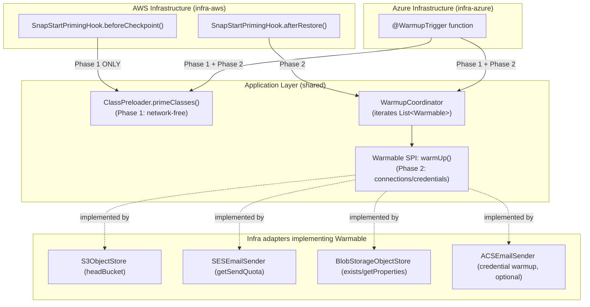

# Design Document: Cold-Start Optimization (ARM64, SnapStart, Priming) and Azure Flex Consumption

## Overview

This design covers cold-start optimization for the Kotlin Clean Architecture demo project. The work is scoped to two concerns:

1. **Move the Azure Function to the Flex Consumption plan (Requirement 1)** — Upgrade the Azure service plan from `Y1` (Consumption) to `FC1` (Flex Consumption) and switch to the flex-compatible function-app resource type. This is a hard **prerequisite** for the Azure side of the priming work, because the Azure `@WarmupTrigger` is only available on the Premium and Flex Consumption plans. The existing Linux OS type and Java 21 application stack are retained — no JVM, Kotlin, or dependency version changes are part of this feature.

2. **ARM64 architecture, SnapStart, and two-phase priming (Requirement 2)** — Enable ARM64 for AWS Lambda, turn on SnapStart (`PublishedVersions`), and add a shared **two-phase priming model** in the application layer:
   - **Phase 1 (`ClassPreloader.primeClasses()`)** — network-free class pre-loading and serialization-cache warmup.
   - **Phase 2 (`Warmable` SPI + `WarmupCoordinator`)** — connection/credential warmup performed by infrastructure adapters.

   AWS runs Phase 1 in the SnapStart `beforeCheckpoint` hook and Phase 2 in `afterRestore`. Azure runs both phases from a `@WarmupTrigger` function (which is why Requirement 1 is its prerequisite).

The design preserves the clean architecture layering (domain → application → infrastructure) and the dual-cloud deployment model. There are no new health check endpoints, no pipeline health-check steps, and no deployment checkpoints. Verification of the change uses the **existing `docs-flow` endpoint** (API key on AWS, function key on Azure), backed by unit tests for the priming components and CDK synth tests for the infrastructure changes.

## Architecture

### Priming Architecture

The priming model has **two phases** with different safety characteristics:

- **Phase 1 — Class_Preload (`primeClasses()`)**: network-free, pure class loading and in-memory serialization warmup. Safe to run anywhere, including inside a SnapStart snapshot.
- **Phase 2 — Warmable warmup (`warmUp()`)**: opens network connections and fetches managed-identity tokens. Must NOT run inside a snapshot (`beforeCheckpoint`), because connections and tokens captured at checkpoint time are invalid after the snapshot is restored on a different host.



### Clean Architecture Layer Impact

| Layer | Changes |
|-------|---------|
| **Domain** | No changes. Domain ports `ObjectStorageInterface` and `DocumentNotificationInterface` keep their existing operations only — they do NOT declare `warmUp()` (Requirement 2.9) |
| **Application** | Add `ClassPreloader` (Phase 1, network-free `primeClasses()`); add `Warmable` SPI + `WarmupCoordinator` (Phase 2 connection/credential warmup) |
| **Infra-AWS** | SnapStart + ARM64; `SnapStartPrimingHook` (`beforeCheckpoint` → Phase 1 only, `afterRestore` → Phase 2); `S3ObjectStore`/`SESEmailSender` additionally implement `Warmable` |
| **Infra-Azure** | `@WarmupTrigger` function runs Phase 1 + Phase 2; `BlobStorageObjectStore` (and optionally `ACSEmailSender`) additionally implement `Warmable` |
| **CDK-AWS** | ARM64 architecture, SnapStart (`PublishedVersions`), published version + API Gateway alias wiring |
| **CDK-Azure** | Flex Consumption plan (`Y1` → `FC1`), flex-compatible function-app resource type, Linux + existing Java 21 stack retained |
| **CI/CD** | Deploy as today, then verify via the existing `docs-flow` endpoint (no new pipeline steps required) |

## Components and Interfaces

### 1. Two-Phase Priming Components (Application Layer)

Priming is split into two components in the shared application layer so both AWS and Azure invoke the same logic. The split exists because the two phases have different safety characteristics under SnapStart (see Priming Architecture above).

#### 1a. Phase 1 — `ClassPreloader` (network-free)

Pre-loads application classes and warms the Jackson/Spring Cloud Function serialization caches by round-tripping a sample `HttpRequest`/`HttpResponse`. It performs **no network or filesystem I/O** and is wrapped in `runCatching` so it never throws. Safe to run in AWS `beforeCheckpoint`, AWS `afterRestore`, and Azure warmup.

```kotlin
// software/application/src/main/kotlin/com/example/clean/architecture/service/ClassPreloader.kt
package com.example.clean.architecture.service

import com.example.clean.architecture.model.HttpRequest
import com.example.clean.architecture.model.HttpResponse
import com.fasterxml.jackson.databind.ObjectMapper
import io.github.oshai.kotlinlogging.KotlinLogging
import org.springframework.http.HttpMethod
import org.springframework.http.HttpStatusCode
import org.springframework.stereotype.Component

private val logger = KotlinLogging.logger {}

/**
 * Phase 1 priming: pre-loads classes and warms serialization caches.
 * Performs NO network or filesystem I/O — safe inside a SnapStart snapshot.
 */
@Component
class ClassPreloader(
    private val objectMapper: ObjectMapper,
) {
    fun primeClasses() {
        logger.info { "Phase 1 priming: pre-loading classes and warming serialization caches" }
        runCatching {
            // Round-trip a sample request/response through the Jackson converters used by
            // Spring Cloud Function. This forces class loading + serializer cache population
            // without any I/O.
            val sampleRequest = HttpRequest(
                method = HttpMethod.POST,
                headers = mapOf("Content-Type" to "application/json"),
                path = "/docs-flow",
                queryParameters = emptyMap(),
                body = null,
            )
            val requestJson = objectMapper.writeValueAsString(sampleRequest)
            objectMapper.readValue(requestJson, HttpRequest::class.java)

            val sampleResponse = HttpResponse(
                httpStatusCode = HttpStatusCode.valueOf(200),
                body = """{"status":"ok"}""",
            )
            objectMapper.writeValueAsString(sampleResponse)

            logger.info { "Phase 1 priming completed successfully" }
        }.onFailure { e ->
            logger.warn(e) { "Phase 1 priming encountered non-fatal error" }
        }
    }
}
```

**Design Decision**: Phase 1 is intentionally network-free. Because it only touches the JVM (class loading) and in-memory serializers, its result is safe to capture in a SnapStart snapshot and safe to repeat in `afterRestore` and Azure warmup (Requirements 2.4, 2.5, 2.6).

#### 1b. Phase 2 — `Warmable` SPI + `WarmupCoordinator` (connection/credential warmup)

`Warmable` is a separate application-layer SPI (a functional interface with a `warmUp()` operation). Infrastructure adapters optionally implement it to open their network connection and/or fetch their managed-identity token. The domain ports (`ObjectStorageInterface`, `DocumentNotificationInterface`) are deliberately **not** touched (Requirement 2.9).

```kotlin
// software/application/src/main/kotlin/com/example/clean/architecture/warmup/Warmable.kt
package com.example.clean.architecture.warmup

/**
 * Phase 2 priming SPI. Infrastructure adapters MAY implement this to open their
 * network connection and/or fetch their managed-identity token before serving traffic.
 *
 * This is intentionally separate from the domain ports (ObjectStorageInterface,
 * DocumentNotificationInterface), which MUST NOT declare warmUp().
 */
fun interface Warmable {
    fun warmUp()
}
```

A coordinator receives every `Warmable` bean Spring discovered and warms each one, isolating failures so a single failing adapter does not abort the rest.

```kotlin
// software/application/src/main/kotlin/com/example/clean/architecture/warmup/WarmupCoordinator.kt
package com.example.clean.architecture.warmup

import io.github.oshai.kotlinlogging.KotlinLogging
import org.springframework.stereotype.Component

private val logger = KotlinLogging.logger {}

/**
 * Phase 2 priming: iterates all Warmable adapters and warms each one.
 * Each warmUp() is wrapped in runCatching so one failure does not abort the rest.
 */
@Component
class WarmupCoordinator(
    private val warmables: List<Warmable>,
) {
    fun warmUpConnections() {
        logger.info { "Phase 2 priming: warming up ${warmables.size} connection(s)/credential(s)" }
        warmables.forEach { warmable ->
            runCatching { warmable.warmUp() }
                .onFailure { e -> logger.warn(e) { "Warmable failed to warm up (non-fatal): ${warmable.javaClass.simpleName}" } }
        }
    }
}
```

**Design Decision**: Injecting `List<Warmable>` (Spring collects all beans implementing the interface; `ObjectProvider<Warmable>` is an equivalent lazy alternative) keeps the coordinator agnostic of which adapters exist. If no adapter implements `Warmable`, the list is empty and Phase 2 is a no-op. Each call is isolated with `runCatching` so a failing warmup (e.g., a transient network error) degrades cold-start performance but never blocks startup (Requirements 2.8, 2.10).

#### 1c. Infra adapters implementing `Warmable`

Adapters add `Warmable` to their existing interface list and perform a single low-cost call (Requirement 2.10):

```kotlin
// infra-aws: S3ObjectStore additionally implements Warmable
class S3ObjectStore(
    @Value("\${aws.s3.bucket-name}") private val bucketName: String,
    private val s3Client: S3Client,
) : ObjectStorageInterface, Warmable {
    override fun warmUp() = runBlocking {
        s3Client.headBucket { bucket = bucketName }   // opens connection, no payload
        Unit
    }
    // ... existing save()/generateSecureAccessUri() unchanged
}

// infra-aws: SESEmailSender additionally implements Warmable
class SESEmailSender(/* ... */) : DocumentNotificationInterface, Warmable {
    override fun warmUp() = runBlocking {
        sesClient.getSendQuota()   // credential + connection warmup, NOT a real send
        Unit
    }
}

// infra-azure: BlobStorageObjectStore additionally implements Warmable
class BlobStorageObjectStore(/* ... */) : ObjectStorageInterface, Warmable {
    override fun warmUp() {
        // exists()/getProperties() forces the DefaultAzureCredential managed-identity token fetch
        containerClient.exists()
    }
}

// infra-azure (optional): ACSEmailSender additionally implements Warmable
//   override fun warmUp() { /* credential warmup only — NOT a real send */ }
```

**Clean-architecture note**: `Warmable` lives in the application layer alongside the domain ports but is a distinct SPI. The domain ports `ObjectStorageInterface` and `DocumentNotificationInterface` keep their existing operations only — they do not declare `warmUp()` (Requirement 2.9).

### 2. AWS SnapStart + ARM64 + Version Alias (CDK-AWS)

Changes to all Lambda function definitions in the AWS CDK stack (Requirements 2.1, 2.2, 2.3):
- `architectures` set to `["arm64"]`
- `snap_start` with `apply_on = "PublishedVersions"`
- A published Lambda version on each deployment, with the API Gateway integration wired to invoke the published version alias (required for SnapStart to take effect)

### 3. AWS SnapStart Priming Hook (Infra-AWS)

The hook implements `org.crac.Resource` and splits the two phases across the CRaC lifecycle:

- `beforeCheckpoint()` runs at publish time, before the snapshot is frozen, so it MUST run **Phase 1 only**. Connections and tokens are unsafe to snapshot (Requirements 2.7, 2.11).
- `afterRestore()` runs on the serving host after thaw, so it runs **Phase 2** to (re)establish connections and fetch a fresh managed-identity token (Requirement 2.12).

```kotlin
import com.example.clean.architecture.service.ClassPreloader
import com.example.clean.architecture.warmup.WarmupCoordinator
import io.github.oshai.kotlinlogging.KotlinLogging
import org.crac.Context
import org.crac.Core
import org.crac.Resource
import org.springframework.stereotype.Component

private val logger = KotlinLogging.logger {}

@Component
class SnapStartPrimingHook(
    private val classPreloader: ClassPreloader,
    private val warmupCoordinator: WarmupCoordinator,
) : Resource {
    init {
        Core.getGlobalContext().register(this)
    }

    override fun beforeCheckpoint(context: Context<out Resource>) {
        // Phase 1 ONLY — network-free. MUST NOT warm connections/credentials here:
        // anything opened now is invalid once the snapshot is restored on another host.
        logger.info { "beforeCheckpoint: running Phase 1 class preload only" }
        classPreloader.primeClasses()
    }

    override fun afterRestore(context: Context<out Resource>) {
        // Phase 2 — re-establish connections and fetch credentials on the serving host.
        logger.info { "afterRestore: running Phase 2 connection/credential warmup" }
        warmupCoordinator.warmUpConnections()
    }
}
```

### 4. Azure Warmup Trigger (Infra-Azure)

The `@WarmupTrigger` runs on every fresh instance on the real serving host before it takes traffic, so it safely runs **both** phases (Requirement 2.13). This trigger is only available on the Premium and Flex Consumption plans, which is why the Flex Consumption move (Requirement 1) is its prerequisite.

```kotlin
@FunctionName("Warmup")
fun warmup(
    @WarmupTrigger(name = "warmupTrigger") warmupContext: String,
    context: ExecutionContext,
) {
    logger.info { "Warmup trigger invoked: running Phase 1 (class preload) and Phase 2 (connection/credential warmup)" }
    classPreloader.primeClasses()         // Phase 1: network-free
    warmupCoordinator.warmUpConnections() // Phase 2: open connections / fetch managed-identity token
}
```

`classPreloader` and `warmupCoordinator` are injected as `private val` dependencies from the application layer.

### 5. Azure Flex Consumption Plan (CDK-Azure)

The Azure CDK stack changes the hosting plan from Consumption to Flex Consumption (Requirement 1):

- Service plan SKU changes from `Y1` to `FC1` (Requirement 1.1).
- The function app uses the flex-compatible resource type `azurerm_linux_function_app_flex_consumption` instead of `azurerm_linux_function_app` (Requirement 1.2).
- All existing application settings (`APPINSIGHTS_INSTRUMENTATIONKEY`, `MAIN_CLASS`, `TriggerBlobStorage__accountName`, `TriggerBlobStorage__credential`, `WEBSITE_RUN_FROM_PACKAGE`, `ACS_ENDPOINT`), the SystemAssigned managed identity, and all role assignments (Storage Blob Data Contributor, Storage Account Contributor, Storage Queue Data Contributor, and the custom ACS role) are explicitly preserved in the stack so the plan move does not drop them (Requirement 1.4).
- The Linux OS type and the **existing Java 21** application stack are retained — no JVM version change (Requirement 1.5).

**Design Decision**: Switching the service-plan SKU and the function-app resource type is a destroy-and-recreate operation in Terraform. The CDK stack declares every app setting, identity, and role assignment explicitly so the recreated function app comes back with identical configuration and no drift.

## Data Models

### Infrastructure Configuration Changes Summary

| Configuration | Current | Target | Requirement |
|--------------|---------|--------|-------------|
| Azure service plan SKU | `Y1` (Consumption) | `FC1` (Flex Consumption) | 1.1 |
| Azure function-app resource type | `azurerm_linux_function_app` | `azurerm_linux_function_app_flex_consumption` | 1.2 |
| Azure OS type | Linux | Linux (unchanged) | 1.5 |
| Azure Java stack | Java 21 | Java 21 (unchanged) | 1.5 |
| Lambda architecture | x86_64 (default) | `arm64` | 2.1 |
| SnapStart | disabled | enabled (`PublishedVersions`) | 2.2 |
| Lambda version/alias | unversioned | published version + API Gateway alias | 2.3 |

### Sample Priming Model Values

Phase 1 round-trips the existing `HttpRequest`/`HttpResponse` application models (no new data model is introduced):

```kotlin
HttpRequest(
    method = HttpMethod.POST,
    headers = mapOf("Content-Type" to "application/json"),
    path = "/docs-flow",
    queryParameters = emptyMap(),
    body = null,
)
```

## Correctness Properties

*A property is a characteristic or behavior that should hold true across all valid executions of a system — essentially, a formal statement about what the system should do. Properties serve as the bridge between human-readable specifications and machine-verifiable correctness guarantees.*

> **Note:** Most of this feature is declarative infrastructure (Azure Flex Consumption SKU/resource type, AWS ARM64/SnapStart) verified with CDK synth tests, plus example-based wiring tests. The two properties below capture the priming **safety invariants** that hold across any application state and any set of registered `Warmable` adapters — the parts where behavior must be guaranteed regardless of configuration.

### Property 1: Priming safety and failure isolation

*For any* state of the application's dependency graph and *for any* set of registered `Warmable` adapters:
- `ClassPreloader.primeClasses()` (Phase 1) SHALL complete without throwing an exception that propagates to the caller, regardless of the dependency-graph state — it never prevents application startup, and it performs no network or filesystem I/O while round-tripping the sample `HttpRequest`/`HttpResponse`; and
- each `Warmable.warmUp()` invocation orchestrated by `WarmupCoordinator` (Phase 2) SHALL be isolated such that a failure in one adapter's warmup is caught and does not abort the warmup of the remaining adapters nor propagate to the caller.

**Validates: Requirements 2.4, 2.5, 2.8, 2.10**

### Property 2: Checkpoint phase isolation

*For any* set of registered `Warmable` adapters, when `SnapStartPrimingHook.beforeCheckpoint()` executes, it SHALL invoke `ClassPreloader.primeClasses()` (Phase 1) and SHALL NOT invoke any `Warmable.warmUp()` / `WarmupCoordinator.warmUpConnections()` (Phase 2) — connection and credential warmup never runs inside the SnapStart snapshot.

**Validates: Requirements 2.7, 2.11**

## Error Handling

### Priming Errors

| Scenario | Behavior |
|----------|----------|
| Class/serialization warmup fails during `primeClasses()` (Phase 1) | Caught by `runCatching`, logged as warning, application continues (non-fatal) |
| A single `Warmable.warmUp()` fails (Phase 2) | Caught per-adapter by `WarmupCoordinator`, logged as warning, remaining adapters still warmed; never propagates |
| `beforeCheckpoint` runs Phase 1 only | By design, no connection/credential warmup occurs inside the snapshot (Requirement 2.11) |
| `afterRestore` / Azure warmup Phase 2 fails entirely | Logged, application continues; first real request re-establishes connections lazily (slower cold start, not an outage) |

**Design Decision**: Both phases are non-fatal. Phase 1 (`primeClasses()`) is wrapped in `runCatching` and Phase 2 isolates each `Warmable` so one adapter's failure does not abort the others. The application still functions even if priming doesn't complete — it just has a slower cold start. Connection/credential warmup is deliberately excluded from `beforeCheckpoint` because connections and managed-identity tokens captured at checkpoint time are invalid once the snapshot is restored on a different host.

### Azure Flex Consumption Migration Errors

| Scenario | Behavior |
|----------|----------|
| FC1 SKU not available in region | Terraform apply fails with a clear error |
| Resource type change (`azurerm_linux_function_app` → flex consumption) | Terraform plan shows destroy+recreate (expected for the plan move) |
| App settings / identity / roles lost during migration | CDK stack explicitly declares all settings, the SystemAssigned identity, and all role assignments (no drift) |

## Testing Strategy

### Why Property-Based Testing Mostly Does NOT Apply

This feature is primarily composed of:
- **Infrastructure as Code** (CDK stacks in Kotlin generating Terraform JSON for Azure Flex Consumption and AWS ARM64/SnapStart)
- **Side-effect-only operations** (priming = class loading + connection/credential warmup)
- **Wiring** (which hook/trigger calls which priming phase)

These are declarative configuration or fixed side-effects with no meaningful input space to explore. The two priming **safety invariants** (Correctness Properties 1 and 2) are the exception: they must hold for any application state and any set of registered `Warmable` adapters, so they are expressed as properties and exercised with mocked collaborators / varying adapter sets. Everything else is covered by example-based unit tests and CDK synth tests.

### Testing Approach

#### Unit Tests (Application Layer)

| Test | What It Verifies |
|------|-----------------|
| `ClassPreloader.primeClasses()` completes without throwing | Phase 1 priming is safe (Property 1, Requirement 2.4) |
| `ClassPreloader.primeClasses()` performs no network/filesystem I/O | Phase 1 is network-free (Property 1, Requirement 2.4) — verified with mocked collaborators asserting no I/O calls |
| `ClassPreloader.primeClasses()` round-trips sample `HttpRequest`/`HttpResponse` | Serialization caches are warmed (Property 1, Requirement 2.5) |
| `WarmupCoordinator.warmUpConnections()` calls `warmUp()` on every registered `Warmable` | Phase 2 coordination works (Requirement 2.8) |
| `WarmupCoordinator` isolates a failing `Warmable` (one throws, others still warmed) | Failure isolation across any set of adapters (Property 1, Requirement 2.10) |

#### Unit Tests (Infrastructure Layer — AWS)

| Test | What It Verifies |
|------|-----------------|
| `S3ObjectStore.warmUp()` invokes `headBucket` once (mocked client) | Phase 2 opens the S3 connection (Requirement 2.10) |
| `SESEmailSender.warmUp()` invokes `getSendQuota` once and does NOT send an email (mocked client) | Phase 2 credential/connection warmup, not a real send (Requirement 2.10) |
| `SnapStartPrimingHook.beforeCheckpoint()` calls `primeClasses()` and NOT any `Warmable`/`warmUpConnections()` | Checkpoint phase isolation (Property 2, Requirements 2.7, 2.11) |
| `SnapStartPrimingHook.afterRestore()` calls `WarmupCoordinator.warmUpConnections()` | Phase 2 runs after thaw (Requirement 2.12) |

#### Unit Tests (Infrastructure Layer — Azure)

| Test | What It Verifies |
|------|-----------------|
| `BlobStorageObjectStore.warmUp()` invokes `exists()`/`getProperties()` once (mocked client) | Phase 2 forces the `DefaultAzureCredential` token fetch (Requirement 2.10) |
| Warmup function invokes both `ClassPreloader.primeClasses()` and `WarmupCoordinator.warmUpConnections()` | Azure warmup runs both phases (Requirement 2.13) |

#### CDK Synth Tests (Infrastructure)

| Test | What It Verifies |
|------|-----------------|
| AWS CDK synthesizes valid Terraform JSON | Infrastructure definition is correct |
| AWS Terraform JSON sets `architectures = ["arm64"]` on every Lambda | ARM64 is configured (Requirement 2.1) |
| AWS Terraform JSON sets `snap_start.apply_on = "PublishedVersions"` on every Lambda | SnapStart is enabled (Requirement 2.2) |
| AWS Terraform JSON publishes a version and wires API Gateway to the published alias | Published-version integration (Requirement 2.3) |
| Azure CDK synthesizes valid Terraform JSON | Infrastructure definition is correct |
| Azure Terraform JSON uses the `FC1` service-plan SKU | Flex Consumption SKU is configured (Requirement 1.1) |
| Azure Terraform JSON uses `azurerm_linux_function_app_flex_consumption` | Flex-compatible resource type (Requirement 1.2) |
| Azure Terraform JSON preserves all app settings, SystemAssigned identity, and role assignments | No regression in settings/identity/roles (Requirement 1.4) |
| Azure Terraform JSON retains Linux OS type and Java 21 stack | OS/runtime retained (Requirement 1.5) |

#### Post-Deployment Verification (no dedicated health endpoint)

Verification uses the **existing `docs-flow` endpoint** — there is no `/health` endpoint in this feature.

| Check | What It Verifies |
|------|-----------------|
| Authenticated request to the AWS `docs-flow` endpoint (API key) succeeds within ~10s on cold start | ARM64 + SnapStart + priming restore and serve correctly (Requirement 2.14) |
| Authenticated request to the Azure `docs-flow` endpoint (function key) succeeds | Azure Flex Consumption deployment is operational (Requirements 1.3, 2.14) |

### Test Framework

- **JUnit 5** with Kotlin test DSL for unit tests
- **MockK** for mocking dependencies (relaxed mocks by default), with `coEvery`/`coVerify` for suspend functions
- **Given-When-Then** naming convention for test methods
- **CDK synth verification** by running the CDK app and inspecting the generated Terraform JSON

### Property Test Configuration

Where the two correctness properties are exercised as property/invariant tests (varying the set of registered `Warmable` adapters and dependency-graph state), each test:
- runs a minimum of 100 iterations, and
- is tagged with a comment referencing the design property, e.g.
  `// Feature: deployment-upgrades-and-healthcheck, Property 1: Priming safety and failure isolation`

### Test Execution Order

1. Unit tests run during `./gradlew build` (compiles the priming components and runs their tests with zero failures — Requirement 2.15)
2. CDK synth tests run during `./gradlew :cdk-aws:run` and `./gradlew :cdk-azure:run`
3. Post-deployment verification hits the existing `docs-flow` endpoint after each cloud deploy
