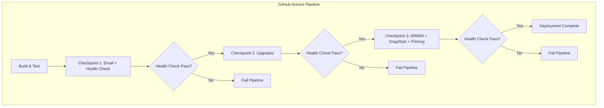
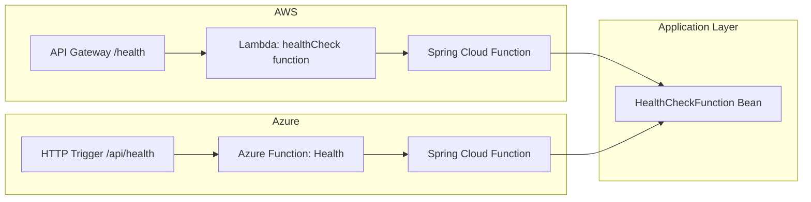

# Design Document: Deployment Upgrades and Health Check

## Overview

This design covers a comprehensive set of deployment improvements and platform upgrades for the Kotlin Clean Architecture demo project. The changes span multiple concerns:

1. **Email configuration** — Replace hardcoded `REPLACEME` placeholders with environment variable injection via GitHub Actions secrets
2. **Health check endpoints** — Add `/health` (AWS) and `/api/health` (Azure) endpoints as Spring Cloud Functions for post-deployment verification
3. **Pipeline health checks** — Integrate automated health check calls into CI/CD workflows with dynamic credential retrieval (AWS CLI / Azure CLI)
4. **Azure Flex Consumption** — Upgrade from Y1 (Consumption) to FC1 (Flex Consumption) plan
5. **Kotlin 2.3.20** — Upgrade the Kotlin compiler and plugins
6. **Dependency upgrades** — Update CDKTF, Spring Boot, Spring Cloud, AWS/Azure SDKs, build plugins, and utility libraries
7. **JVM 25** — Upgrade the JVM target across build, CI/CD, and cloud runtimes
8. **ARM64 + SnapStart + Priming** — Enable ARM64 architecture, SnapStart for AWS Lambda, and a shared priming component in the application layer
9. **Deployment checkpoints** — Three-stage deployment with health check gates between stages

The design preserves the clean architecture layering (domain → application → infrastructure) and the dual-cloud deployment model.

## Architecture

### High-Level Deployment Flow



### Health Check Architecture



### Priming Architecture

```mermaid
flowchart TD
    subgraph "Application Layer (shared)"
        Primer[ApplicationPrimer]
    end
    subgraph "AWS Infrastructure"
        SnapStart[SnapStart beforeCheckpoint] --> Primer
    end
    subgraph "Azure Infrastructure"
        WarmupTrigger[@WarmupTrigger] --> Primer
    end
```

### Clean Architecture Layer Impact

| Layer | Changes |
|-------|---------|
| **Domain** | No changes |
| **Application** | Add `HealthCheckFunction` bean, add `ApplicationPrimer` component |
| **Infra-AWS** | Health check Lambda config, SnapStart + ARM64 + priming hook |
| **Infra-Azure** | Health check HTTP trigger, `@WarmupTrigger` priming function |
| **CDK-AWS** | `/health` API Gateway resource, ARM64, SnapStart, version alias |
| **CDK-Azure** | Flex Consumption plan, Java 25 runtime |
| **CI/CD** | JDK 25, health check steps, deployment checkpoints |

## Components and Interfaces

### 1. Health Check Function (Application Layer)

A Spring Cloud Function bean that returns the application's operational status.

```kotlin
// software/application/src/main/kotlin/com/example/clean/architecture/service/HealthCheckFunction.kt
package com.example.clean.architecture.service

import org.springframework.context.annotation.Bean
import org.springframework.context.annotation.Configuration
import java.util.function.Supplier

@Configuration
class HealthCheckConfig {
    @Bean
    fun healthCheck(): Supplier<HealthStatus> = Supplier {
        HealthStatus(status = "UP")
    }
}

data class HealthStatus(val status: String)
```

**Design Decision**: The health check is a `Supplier<HealthStatus>` (no input) rather than a `Function<Request, Response>`. This keeps it simple — it only needs to confirm the Spring context loaded successfully. The fact that the function can be invoked at all proves the application is operational.

### 2. Application Primer (Application Layer)

A reusable component that pre-loads and initializes application classes to reduce cold start latency. Placed in the application layer so both AWS and Azure can invoke it.

```kotlin
// software/application/src/main/kotlin/com/example/clean/architecture/service/ApplicationPrimer.kt
package com.example.clean.architecture.service

import io.github.oshai.kotlinlogging.KotlinLogging
import org.springframework.stereotype.Component

private val logger = KotlinLogging.logger {}

@Component
class ApplicationPrimer(
    private val handleDocsFlowRequest: HandleDocsFlowRequest,
) {
    fun prime() {
        logger.info { "Priming application: pre-loading classes and warming up dependencies" }
        // Force class loading of key application components
        runCatching {
            // Touch the request handler to ensure its dependency tree is loaded
            handleDocsFlowRequest.javaClass.declaredMethods
            // Force Jackson ObjectMapper initialization
            Class.forName("com.fasterxml.jackson.databind.ObjectMapper")
            logger.info { "Application priming completed successfully" }
        }.onFailure { e ->
            logger.warn(e) { "Application priming encountered non-fatal error" }
        }
    }
}
```

**Design Decision**: Priming is intentionally lightweight — it forces class loading of the dependency graph without making actual I/O calls. This is safe to run during SnapStart's `beforeCheckpoint` and Azure's `@WarmupTrigger`.

### 3. AWS Health Check Lambda Configuration (CDK-AWS)

A new Lambda function definition in the CDK stack with:
- `SPRING_CLOUD_FUNCTION_DEFINITION` set to `healthCheck`
- API Gateway resource at `/health` with GET method and API key required
- Same role and permissions as existing functions

### 4. AWS SnapStart + ARM64 + Version Alias (CDK-AWS)

Changes to all Lambda function definitions:
- `architectures` set to `["arm64"]`
- `snap_start` with `apply_on = "PublishedVersions"`
- A `LambdaAlias` or published version resource for API Gateway to invoke

### 5. Azure Health Check Function (Infra-Azure)

```kotlin
// In DocsFlowFunctions.kt or a new HealthFunctions.kt
@FunctionName("Health")
fun health(
    @HttpTrigger(
        name = "request",
        methods = [HttpMethod.GET],
        authLevel = AuthorizationLevel.FUNCTION,
        route = "health"
    ) request: HttpRequestMessage<Void>,
    context: ExecutionContext,
): HttpResponseMessage {
    return runCatching {
        request.createResponseBuilder(HttpStatus.OK)
            .header("Content-Type", "application/json")
            .body("""{"status":"UP"}""")
            .build()
    }.getOrElse {
        request.createResponseBuilder(HttpStatus.SERVICE_UNAVAILABLE)
            .header("Content-Type", "application/json")
            .body("""{"status":"DOWN"}""")
            .build()
    }
}
```

### 6. Azure Warmup Trigger (Infra-Azure)

```kotlin
@FunctionName("Warmup")
fun warmup(
    @WarmupTrigger(name = "warmupTrigger") warmupContext: String,
    context: ExecutionContext,
) {
    logger.info { "Warmup trigger invoked, running application priming" }
    applicationPrimer.prime()
}
```

### 7. AWS Priming Hook (Infra-AWS)

For SnapStart, priming runs via CRaC's `beforeCheckpoint`:

```kotlin
import org.crac.Context
import org.crac.Core
import org.crac.Resource

@Component
class SnapStartPrimingHook(
    private val applicationPrimer: ApplicationPrimer,
) : Resource {
    init {
        Core.getGlobalContext().register(this)
    }

    override fun beforeCheckpoint(context: Context<out Resource>) {
        applicationPrimer.prime()
    }

    override fun afterRestore(context: Context<out Resource>) {
        // No-op: application is already primed
    }
}
```

### 8. Pipeline Health Check Steps

**AWS Pipeline** — After `terraform apply`:
```yaml
- name: Retrieve API Gateway URL and API Key
  run: |
    API_URL=$(terraform output -raw api_gateway_url)
    API_KEY_ID=$(aws apigateway get-api-keys --name-query "DocsFlow" --include-values --query 'items[0].value' --output text)
    echo "API_URL=$API_URL" >> $GITHUB_ENV
    echo "API_KEY=$API_KEY_ID" >> $GITHUB_ENV

- name: Health Check
  run: |
    for i in 1 2 3; do
      STATUS=$(curl -s -o /dev/null -w "%{http_code}" -m 30 \
        -H "x-api-key: $API_KEY" "$API_URL/health")
      if [ "$STATUS" = "200" ]; then exit 0; fi
      sleep 10
    done
    exit 1
```

**Azure Pipeline** — After `azureFunctionsDeploy`:
```yaml
- name: Retrieve Function URL and Key
  run: |
    FUNC_URL=$(az functionapp show --name docs-flow-spring-clean-architecture-fun \
      --resource-group $AZURE_RESOURCE_GROUP_NAME --query defaultHostName -o tsv)
    FUNC_KEY=$(az functionapp keys list --name docs-flow-spring-clean-architecture-fun \
      --resource-group $AZURE_RESOURCE_GROUP_NAME --query functionKeys.default -o tsv)
    echo "FUNC_URL=https://$FUNC_URL" >> $GITHUB_ENV
    echo "FUNC_KEY=$FUNC_KEY" >> $GITHUB_ENV

- name: Health Check
  run: |
    for i in 1 2 3; do
      STATUS=$(curl -s -o /dev/null -w "%{http_code}" -m 30 \
        "$FUNC_URL/api/health?code=$FUNC_KEY")
      if [ "$STATUS" = "200" ]; then exit 0; fi
      sleep 10
    done
    exit 1
```

### 9. Deployment Checkpoints

The reusable workflow files will be restructured into three sequential jobs:

| Checkpoint | Deploys | Verifies |
|-----------|---------|----------|
| 1 | Email config + Health check infra | Health check returns 200 |
| 2 | Flex Consumption + Kotlin 2.3.20 + Dependencies + JVM 25 | Health check returns 200 |
| 3 | ARM64 + SnapStart + Priming | Health check returns 200 |

Each checkpoint is a separate GitHub Actions job with `needs:` dependency on the previous checkpoint.

## Data Models

### HealthStatus Response

```kotlin
data class HealthStatus(
    val status: String  // "UP" or "DOWN"
)
```

JSON representation:
```json
{"status": "UP"}
```

### Terraform Outputs (new)

The CDK stacks will export outputs needed by the pipeline health check steps:

**AWS CDK Stack outputs:**
- `api_gateway_url` — The base URL of the API Gateway stage (e.g., `https://abc123.execute-api.eu-west-1.amazonaws.com/demo`)
- `api_key_name` — The name of the API key for lookup via AWS CLI

**Azure CDK Stack outputs:**
- `function_app_name` — The Azure Function App name for CLI queries
- `resource_group_name` — The resource group for CLI queries

### Pipeline Environment Variables

| Variable | Source | Used By |
|----------|--------|---------|
| `SENDER_EMAIL` | GitHub Secret | AWS Lambda env var, Azure app setting |
| `RECIPIENT_EMAIL` | GitHub Secret | AWS Lambda env var, Azure app setting |
| `API_URL` | Terraform output + runtime | AWS health check step |
| `API_KEY` | AWS CLI at runtime | AWS health check step |
| `FUNC_URL` | Azure CLI at runtime | Azure health check step |
| `FUNC_KEY` | Azure CLI at runtime | Azure health check step |

### Build Configuration Changes Summary

| Configuration | Current | Target |
|--------------|---------|--------|
| Kotlin version | 2.1.0 | 2.3.20 |
| JVM target | 21 | 25 |
| Spring Boot | 3.3.9 | 3.5.x (latest stable) |
| Java toolchain | 21 | 25 |
| AWS Lambda runtime | java21 | java25 |
| Azure Java version | 21 | 25 |
| Azure SKU | Y1 | FC1 |
| Lambda architecture | x86_64 (default) | arm64 |
| SnapStart | disabled | enabled (PublishedVersions) |

## Correctness Properties

*A property is a characteristic or behavior that should hold true across all valid executions of a system — essentially, a formal statement about what the system should do. Properties serve as the bridge between human-readable specifications and machine-verifiable correctness guarantees.*

> **Note:** This feature is primarily infrastructure configuration, CI/CD pipelines, build configuration, and side-effect-only operations. Full property-based testing does not strongly apply here. The properties below capture the key invariants that can be verified with lightweight tests.

### Property 1: Health check idempotency

*For any* number of sequential invocations of the health check endpoint on a healthy deployment, the response SHALL always be HTTP 200 with `{"status":"UP"}` — invoking the health check N times produces the same result each time.

**Validates: Requirements 2.1, 3.1**

### Property 2: Priming safety

*For any* state of the application's dependency graph (including cases where class loading encounters missing or broken classes), the `ApplicationPrimer.prime()` method SHALL complete without throwing an exception that propagates to the caller, ensuring it never prevents application startup.

**Validates: Requirements 10.4, 10.5**

### Property 3: Deployment checkpoint ordering

*For any* deployment pipeline execution, Deployment Checkpoint N+1 SHALL never execute unless Deployment Checkpoint N has passed its health check verification — the pipeline enforces strict sequential ordering with no checkpoint skipping.

**Validates: Requirements 11.4, 11.5**

### Property 4: Configuration completeness

*For any* configuration file in the deployed application (AWS and Azure `application.properties`), the file SHALL NOT contain the literal string `"REPLACEME"` or any other placeholder value after deployment completes.

**Validates: Requirements 1.5**

## Error Handling

### Health Check Endpoint Errors

| Scenario | AWS Behavior | Azure Behavior |
|----------|-------------|----------------|
| Spring context loads successfully | 200 `{"status":"UP"}` | 200 `{"status":"UP"}` |
| Internal error during invocation | 503 `{"status":"DOWN"}` | 503 `{"status":"DOWN"}` |
| Lambda/Function timeout (>10s) | API Gateway returns 504 | Azure returns 500 |

**Implementation**: The health check function wraps its logic in `runCatching`. If the Spring context failed to load, the function bean won't exist and the invocation itself will fail, producing a 5xx response from the platform.

### Pipeline Health Check Failures

| Scenario | Behavior |
|----------|----------|
| Health check returns non-200 | Retry up to 3 times with 10s delay |
| Connection timeout (>30s) | Treat as failed attempt, retry |
| All 3 retries exhausted | Fail the workflow run, report last status code |
| DNS resolution failure | Treat as failed attempt, retry |

**Design Decision**: 3 retries with 10-second delays gives the function up to ~90 seconds total to become available after deployment. This accounts for cold start time, especially before SnapStart is enabled in Checkpoint 1.

### Priming Errors

| Scenario | Behavior |
|----------|----------|
| Class loading fails during priming | Log warning, continue (non-fatal) |
| Priming throws unexpected exception | Caught by `runCatching`, logged, application continues |
| SnapStart `beforeCheckpoint` fails | Lambda snapshot creation fails, deployment rolls back |

**Design Decision**: Priming failures are non-fatal. The application should still function even if priming doesn't complete — it will just have a slower cold start. The exception is SnapStart's `beforeCheckpoint` — if that throws, AWS won't create the snapshot, which is the correct behavior (fail fast during deployment, not at runtime).

### Deployment Checkpoint Failures

| Scenario | Behavior |
|----------|----------|
| Checkpoint 1 health check fails | Pipeline fails, Checkpoints 2 and 3 do not execute |
| Checkpoint 2 health check fails | Pipeline fails, Checkpoint 3 does not execute |
| Checkpoint 3 health check fails | Pipeline fails, reports which checkpoint failed |
| Terraform apply fails | Job fails immediately (no health check attempted) |

### Azure Flex Consumption Migration Errors

| Scenario | Behavior |
|----------|----------|
| FC1 SKU not available in region | Terraform apply fails with clear error |
| Resource type mismatch | Terraform plan shows destroy+recreate (expected for plan change) |
| App settings lost during migration | CDK stack explicitly declares all settings (no drift) |

### Dependency Upgrade Errors

| Scenario | Behavior |
|----------|----------|
| Binary incompatibility | Build fails at compile time with clear error |
| Runtime incompatibility | Tests fail, caught by `./gradlew build` |
| Deprecated API usage | Compiler warnings (Requirement 8.29 requires zero deprecation warnings) |

## Testing Strategy

### Why Property-Based Testing Does NOT Apply

This feature is primarily composed of:
- **Infrastructure as Code** (CDK stacks in Kotlin generating Terraform JSON)
- **CI/CD pipeline configuration** (GitHub Actions YAML)
- **Build configuration** (Gradle version strings)
- **Simple static responses** (health check returns fixed JSON)
- **Side-effect-only operations** (priming = class loading)

None of these have behavior that varies meaningfully with input. The health check always returns the same response. Priming always loads the same classes. CDK stacks are declarative configuration. There is no input space to explore with property-based testing.

### Testing Approach

#### Unit Tests (Application Layer)

| Test | What It Verifies |
|------|-----------------|
| `HealthCheckFunction` returns `HealthStatus("UP")` | Health check bean works correctly |
| `ApplicationPrimer.prime()` completes without exception | Priming logic is safe |
| `ApplicationPrimer.prime()` logs success message | Priming executes expected path |

#### Unit Tests (Infrastructure Layer — AWS)

| Test | What It Verifies |
|------|-----------------|
| Health check Lambda handler returns 200 with `{"status":"UP"}` | AWS adapter correctly maps response |
| Health check Lambda handler returns 503 on error | Error path works |
| `SnapStartPrimingHook.beforeCheckpoint()` invokes `ApplicationPrimer.prime()` | SnapStart integration |

#### Unit Tests (Infrastructure Layer — Azure)

| Test | What It Verifies |
|------|-----------------|
| Health function returns 200 with `{"status":"UP"}` | Azure adapter correctly maps response |
| Health function returns 503 on error | Error path works |
| Warmup function invokes `ApplicationPrimer.prime()` | Warmup trigger integration |

#### Integration Tests (CDK Stacks)

| Test | What It Verifies |
|------|-----------------|
| AWS CDK synthesizes valid Terraform JSON | Infrastructure definition is correct |
| Azure CDK synthesizes valid Terraform JSON | Infrastructure definition is correct |
| AWS Terraform JSON contains `/health` API Gateway resource | Health endpoint is provisioned |
| AWS Terraform JSON contains arm64 architecture | ARM64 is configured |
| AWS Terraform JSON contains snap_start configuration | SnapStart is enabled |
| Azure Terraform JSON contains FC1 SKU | Flex Consumption is configured |
| Azure Terraform JSON preserves all app settings | No regression in settings |

#### Smoke Tests (Configuration)

| Test | What It Verifies |
|------|-----------------|
| `application.properties` (AWS) has no "REPLACEME" | Email config is parameterized |
| `application.properties` (Azure) has no "REPLACEME" | Email config is parameterized |
| `build.gradle.kts` specifies Kotlin 2.3.20 | Kotlin version is correct |
| `build.gradle.kts` specifies JVM 25 | JVM target is correct |
| Workflow YAML specifies java-version 25 | CI/CD uses correct JDK |

#### End-to-End Tests (Post-Deployment)

| Test | What It Verifies |
|------|-----------------|
| `curl $API_URL/health -H "x-api-key: $KEY"` returns 200 | AWS deployment is operational |
| `curl $FUNC_URL/api/health?code=$KEY` returns 200 | Azure deployment is operational |

### Test Framework

- **JUnit 5** with Kotlin test DSL for unit tests
- **MockK** for mocking dependencies (relaxed mocks by default)
- **Given-When-Then** naming convention for test methods
- **CDK synth verification** by running the CDK app and inspecting generated JSON
- **curl** in pipeline scripts for end-to-end health checks

### Test Execution Order

1. Unit tests run during `./gradlew build` (pre-deployment)
2. CDK synth tests run during `./gradlew :cdk-aws:run` and `./gradlew :cdk-azure:run`
3. End-to-end health checks run post-deployment in each checkpoint

