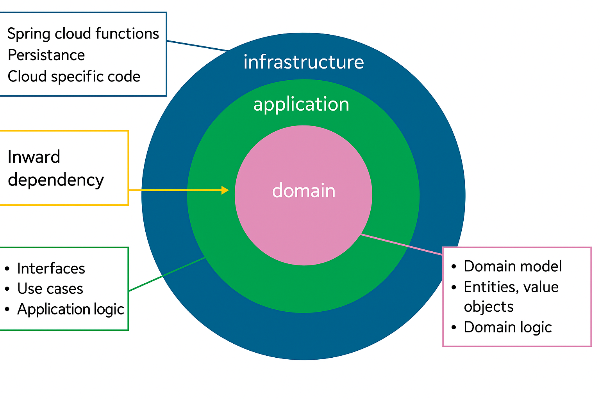
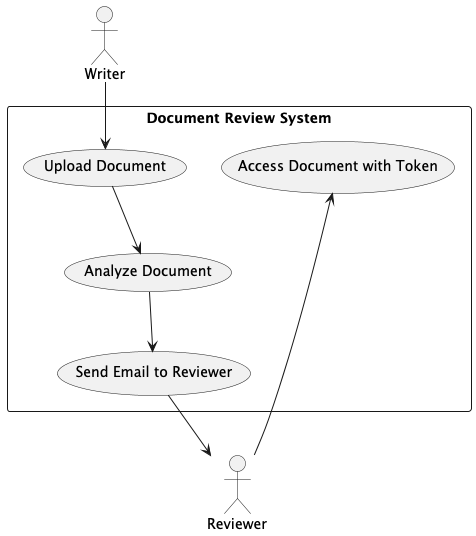
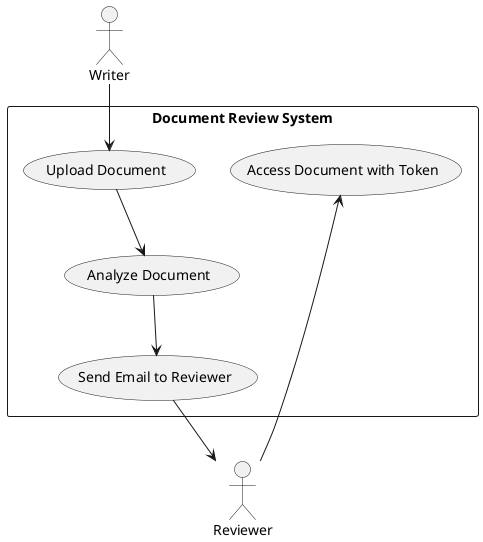
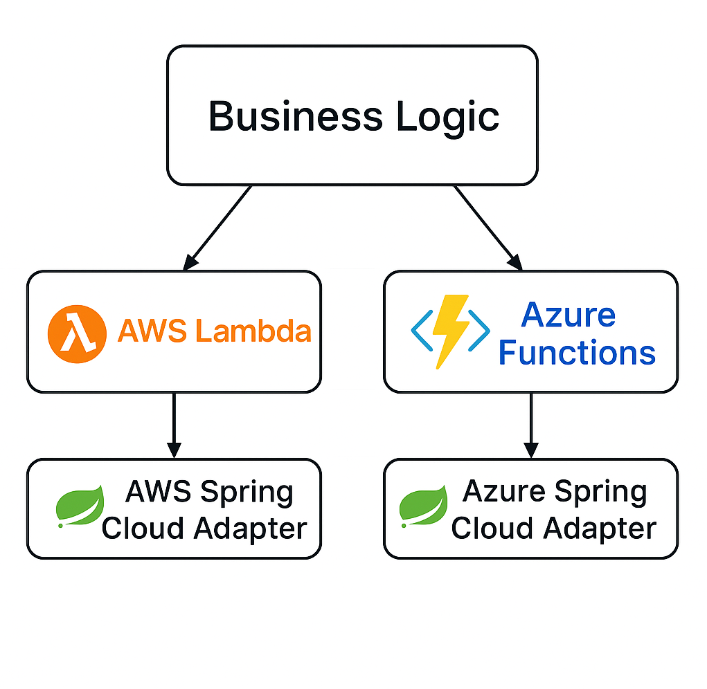

# Clean Architecture

## Read the full article about Clean Architecture for Serverless [here](https://medium.com/nntech/keeping-business-logic-portable-in-serverless-functions-with-clean-architecture-bd1976276562).



# Project Structure

```
kotlin-clean-architecture-example-docs-flow/
│
├── build.gradle.kts     // Root build file
├── settings.gradle.kts  // Contains include statements for subprojects
│
├── .github/             // GitHub-specific configuration
│   └── workflows/       // GitHub Actions workflow definitions
│       ├── feature-aws.yml                  // Triggers AWS deployment for feature branches
│       ├── feature-azure.yml                // Triggers Azure deployment for feature branches
│       ├── main-aws.yml                     // Triggers AWS deployment for main branch
│       ├── main-azure.yml                   // Triggers Azure deployment for main branch
│       ├── workflow-build-deploy-aws.yml    // Reusable workflow for AWS Lambda build and deployment
│       └── workflow-build-deploy-azure.yml  // Reusable workflow for Azure Function build and deployment
│
├── docs/               // Documentation files
│   └── postman/                 // Postman collections and environments
│       ├── AWS Conf Demo.postman_collection.json    // Collection for AWS app
│       ├── Azure Conf Demo.postman_collection.json  // Collection for Azure app
│       ├── Health Checks.postman_collection.json             // Collection for Initial health checks on AWS app and Azure app
│       └── Demo Example.postman_environment.json             // Environment variables for both deployments
│
├── software/            // Holds all the business logic and application code
│   ├── domain/
│   │   ├── src/
│   │   └── build.gradle.kts
│   ├── application/
│   │   ├── src/
│   │   └── build.gradle.kts
│   └── infra/            // Infrastructure specific code
│       ├── aws/          // AWS-specific code, including AWS Lambda
│       │   ├── src/
│       │   └── build.gradle.kts
│       └── azure/        // Azure-specific code, including Azure Function
│           ├── src/
│           └── build.gradle.kts
│
└── cdk/                  // Terraform CDK Kotlin code
    ├── aws/
    │   ├──src/
    │   ├──build.gradle.kts
    │   ├──cdktf.out/            // Generated by generateTerraform.sh
    │   ├──generated/            // Generated by generateTerraform.sh
    │   └──generateTerraform.sh  // Generates terraform json from CDK, run when infrastructure changes
    └── azure/
        ├──src/
        ├──build.gradle.kts
        ├──cdktf.out/            // Generated by generateTerraform.sh
        ├──generated/            // Generated by generateTerraform.sh
        └──generateTerraform.sh  // Generates terraform json from CDK, run when infrastructure changes

```

# Docs Flow

## Use cases



## API Endpoints

### docs-flow
- **Endpoint**: `/docs-flow`
- **Method**: POST
- **Description**: Accepts Word documents and stores them in blob storage (Azure) or S3 (AWS)
- **Request Body**: Word document content
- **Response**: JSON with document ID and URL
  ```json
  {
    "id": "document-uuid",
    "url": "storage-url"
  }
  ```

# Solution Architecture


# Spring Cloud Function



# Getting Started
## Prerequisites
Before you begin, ensure you have the following:

- **Java 21** or later installed
- Git for version control
- Gradle (the project uses the Gradle wrapper, so you don't need to install it separately)
- IDE of your choice (IntelliJ IDEA recommended for Kotlin development)

### Cloud Provider Requirements
This project can be deployed to either AWS or Azure or both. Depending on your target environment, you'll need:

#### AWS Account Requirements
- An AWS account with permissions to:
  - Create and manage Lambda functions
  - Create and manage API Gateway resources
  - Create and manage IAM roles and policies
  - Create and manage S3 buckets
  - Configure SES Identities (Sandbox)
  - Deploy AWS resources via Terraform
- Create identities for sender and receiver email address in your SES (Sandbox)

#### Azure Account Requirements
- An Azure account with permissions to:
  - Create and manage Azure Functions
  - Create and manage Storage accounts
  - Create and manage Application Insights
  - Create Azure Communication resources
  - Assign roles to managed identities
  - Deploy Azure resources via Terraform
- Register your subscription with microsoft communication:
  - `az provider register --namespace Microsoft.Communication`
  - wait till Registered status: `az provider show --namespace Microsoft.Communication --query "registrationState"
`

## Build Project
After checking out the project, ensure it can build properly by running:
```bash
./gradlew build
```
from the root of the project.

## Update Infrastructure
If you plan to deploy the infrastructure, you may need to update the following:

### AWS
- Update the AWS region in the workflow file if needed (default is "eu-west-1")
- The S3 bucket for Terraform state is set to "kotlin-lambda-terraform-state" (this bucket must exist before deployment)
- The S3 bucket for Lambda deployment is set to "lambda-deployment-clean-architecture-example"

### Azure
- Update the Azure resource group name (default is "DefaultResourceGroup-WEU")
- Update the Azure region if needed (default is "West Europe")
- Update the Azure data location if needed (default is "Europe")
- The storage account for DocsFlow is set to "docsflow" (this storage account must exist before deployment)
- The storage container for Terraform state is set to "cleanarchitecturesta" (this container must exist in the storage account before deployment)

Ensure to run `generateTerraform.sh` after any infra changes in the appropriate cdk module (aws or azure) to regenerate terraform configuration.

## Configure Pipeline

If you are using GitHub Actions for deployment, you'll need to configure OIDC: 
* [OpenID Connect in AWS](https://docs.github.com/en/actions/security-for-github-actions/security-hardening-your-deployments/configuring-openid-connect-in-amazon-web-services)
* [OpenID Connect in Azure](https://docs.github.com/en/actions/security-for-github-actions/security-hardening-your-deployments/configuring-openid-connect-in-azure)

Configure the following GitHub repository secrets:

### AWS Deployment Secrets
- `AWS_ACCOUNT_ID`: Your AWS account ID
- `OIDC_ROLE_NAME`: Your OIDC role name

### Azure Deployment Secrets
- `AZURE_SUBSCRIPTION_ID`: Your Azure subscription ID
- `AZURE_OIDC_CLIENT_ID`: Your Azure OIDC client ID
- `AZURE_TENANT_ID`: Your Azure tenant ID
- `AZURE_STORAGE_ACCOUNT_NAME`: Your Azure storage account name
- `AZURE_STORAGE_ACCOUNT_ACCESS_KEY`: Your Azure storage account access key for storage account that supports the Azure Function app deployment and operation (in this example it is called `cleanarchitecturesta`)

### Azure Gradle Plugin
The Azure Gradle plugin (com.microsoft.azure.azurefunctions) used for deploying Azure Functions requires a storage account access key and does not support managed identity authentication yet. This is why you need to provide the `AZURE_STORAGE_ACCOUNT_ACCESS_KEY` as a secret in your GitHub repository for the deployment workflow to function properly.

**Note** that this storage account, e.g. `cleanarchitecturesta`,  is specifically used to support the Azure Function app deployment and operation. The application also uses a separate storage account for its core functionality (document storage - `docsflow`).

## Testing: Postman Collections and Environment
The `docs/postman` directory contains Postman collections and an environment file for testing the MockNest API:

### Collections
- **AWS MockNest Conf Demo.postman_collection.json**: Collection for testing the MockNest API deployed on AWS
- **Azure MockNest Conf Demo.postman_collection.json**: Collection for testing the MockNest API deployed on Azure
- **Health Checks.postman_collection.json**: Collection for running both AWS and Azure health checks

AWS and Azure collections contain requests for:
- Creating mock API endpoints
- Testing mock endpoints
- Resetting mappings
- Viewing near misses (requests that almost matched a mapping)
- Checking the health of the service
- Deleting mappings

Health Check collection is a shortcut to run all health checks at once.

### Environment
- **Demo Example.postman_environment.json**: Contains environment variables used by both collections

#### Environment Configuration
Before using the collections, you need to configure the environment variables:

**For AWS deployment:**
- `AWS_URL`: Set to your AWS API Gateway endpoint
- `api_key`: Set to your AWS API Gateway API key

**For Azure deployment:**
- `AZURE_URL`: Set to your Azure Function App endpoint
- `admin_function_key`: Set to your Azure Function admin key (for admin operations)
- `client_function_key`: Set to your Azure Function mocknest key (for client operations)

## Questions or Issues
If you have questions or encounter issues, please log them in the repository's issue tracker:
[https://github.com/elenavanengelenmaslova/kotlin-clean-architecture-example-docs-flow/issues](https://github.com/elenavanengelenmaslova/kotlin-clean-architecture-example-docs-flow/issues)

## Reference Documentation

For further reference, please consider the following sections:

* [Official Gradle documentation](https://docs.gradle.org)
* [Spring Boot Gradle Plugin Reference Guide](https://docs.spring.io/spring-boot/docs/3.1.4/gradle-plugin/reference/html/)
* [Create an OCI image](https://docs.spring.io/spring-boot/docs/3.1.4/gradle-plugin/reference/html/#build-image)
* [Function](https://docs.spring.io/spring-cloud-function/docs/current/reference/html/spring-cloud-function.html)

### Additional Links

These additional references should also help you:

* [Gradle Build Scans – insights for your project's build](https://scans.gradle.com#gradle)
* [Various sample apps using Spring Cloud Function](https://github.com/spring-cloud/spring-cloud-function/tree/main/spring-cloud-function-samples)

## Support this project
If this project saved you time, consider buying me a [coffee ☕](https://buymeacoffee.com/elenavanengelen) to help keep it up to date and maintained.

[](https://buymeacoffee.com/elenavanengelen)

